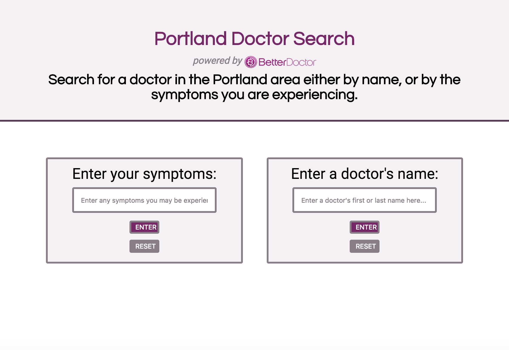

# Portland Doctor Lookup

#### An app using the BetterDoctor API

#### by **Jessie Waite**

## Description

This application was made to satisfy the week two code review for Epicodus Javascript course. The application uses the BetterDoctor API to display information about doctors. The user can search for information by either symptoms they are experiencing, or by doctor name. The search displays the doctor's image, their name, their bio, their practice address, phone number and website. If the search returns no results, the user is notified.

## Technologies used:

  This application requires a web browser in order to run. I used several applications while developing this project. Those include:
    - HTML / CSS
    - Javascript / JQuery
    - Gulp / Browserify / Vinyl-Source-Stream / Uglify / Bower
    - Jshint
    - Jasmine / Karma
    - Babelify

## Set-Up:

  In order to set-up this application, follow these directions:
  - Clone the application to your desktop from Github
  - Ensure Node Project Manager (NPM) is installed on your device. Initialize NPM in the project by entering "$npm init" at the root level of the directory.
  - Ensure Gulp is installed by entering "$npm install gulp"
  - Ensure Bower is installed on your device. Initialize Bower in the project by entering "$bower init" at the root level of the directory.
  - Obtain your own (free) BetterDoctor API key at: https://developer.betterdoctor.com/ (If you intend to save this project, add the .env file to your .gitignore file, so you do not unintentionally share your API key).
  - Create a .env file in the root directory, and add your API key to it using the following syntax:
  exports.apiKey = "[API-KEY GOES HERE]";
  - In the command line, run '$gulp serve' to launch the application in your web browser.

## GH-Pages Link:

  Access this project through the following link: https://jbellwaite.github.io/js-wk2-code-review/

## Known Bugs:

  No known bugs at this time.

## Support and contact details

Email Jessie with comments or questions.

jess.bell@me.com

### License

*{This software is not licensed under the MIT license}*

Copyright (c) 2017 **_{Jessie Bell Waite}_**
